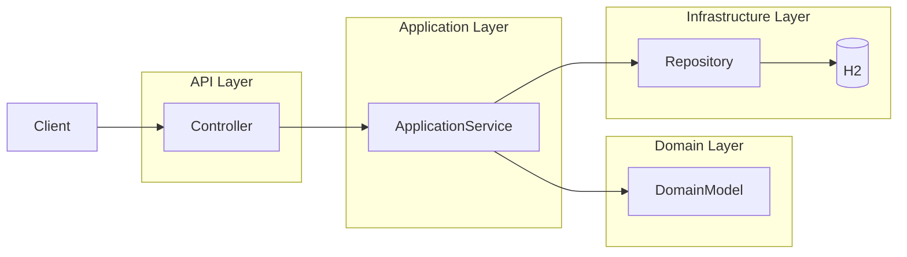

# FinLedger

FinLedger is a backend ledger system implementing double-entry accounting using domain-driven design (DDD) principles. 
The project demonstrates a production-style Java backend with layered architecture, strong domain invariants, and test-driven development.

---

## Purpose
The backend manages financial transactions while enforcing strict double-entry accounting invariants. It demonstrates:
- Domain-driven design (DDD)
- Aggregate modeling (Account and JournalEntry aggregates)
- Repository abstraction
- Service-layer orchestration
- Test-driven development

Core domain concepts include:

- **Account** - financial accounts with currency and type
- **JournalEntry** - represents a transaction
- **JournalLine** - debit/credit lines belonging to a transaction

All transactions must satisfy double-entry accounting rules:
- At least two lines per transaction
- Total debits must equal total credits

This is a demo backend API using an in-memory H2 database for safe, self-contained testing; no real bank data is stored.

---

## Live Demo

The backend API is live at: [https://finledger-production.up.railway.app](https://finledger-production.up.railway.app)
You can try the backend API on Railway:

- Create Account: `POST https://finledger-production.up.railway.app/accounts`
- Get Account: `GET https://finledger-production.up.railway.app/accounts/{id}`
- Record Transactions: `POST https://finledger-production.up.railway.app/transactions`
- Reverse Transactions: `POST https://finledger-production.up.railway.app/transactions/{id}/reverse`
- Get Account Balance: `GET https://finledger-production.up.railway.app/accounts/{id}/balance`

> Note: This is a demo backend using an in-memory H2 database. All data is temporary and self-contained.

---

## Quick Start

Run locally:

`cd backend-spring`
`mvn spring-boot:run`

API will start at:
http://localhost:8080

---

## Tech Stack
- Java 21
- Spring Boot
- Maven
- JPA / Hibernate
- H2 Database (in-memory for demo; can be switched to PostgreSQL for production)
- JUnit 5
- Mockito
- AssertJ

The backend uses an in-memory H2 database for quick local development. Switching to PostgreSQL is straightforward by updating application.properties and adding the driver dependency.


---

## Architecture

The backend follows a layered architecture:

`api/            Controllers and request/response DTOs`

`api/errors      Global exception handling for API responses`

`application/    Application services coordinating domain logic`

`domain/         Core business logic and aggregates`

`infrastructure/ Persistence adapters (JPA repositories)`




---

## Domain Model

```Mermaid
classDiagram

class Account {
  AccountId id
  String name
  AccountType type
  Currency currency
  AccountStatus status
}

class JournalEntry {
  JournalEntryId id
  String description
  Instant timestamp
  bool posted
}

class JournalLine {
  JournalLineId id
  AccountId accountId
  Money amount
  EntrySide side
  Instant occurredAt
}

class Money {
  BigDecimal amount
  Currency currency
}

JournalEntry "1" --> "*" JournalLine
JournalLine "*" --> "1" Account
JournalLine --> Money
```

---

## Ledger Invariants

The ledger enforces strict accounting rules to maintain financial correctness.

1. A transaction must contain at least two journal lines.
2. The total debits must equal the total credits.
3. All journal lines in a transaction must share the same currency.
4. Posted transactions are immutable.
5. Journal lines cannot reference future timestamps.
6. Journal lines must reference valid accounts.

These invariants are enforced within the domain layer to ensure the ledger cannot enter an invalid state.

--

## Ubiquitous Language

The domain model uses consistent terminology from accounting systems.

| Term | Meaning |
|-----| ----- |
| Account | A financial account that can hold balances |
| Journal Entry | A transaction containing one or more journal lines |
| Journal Line | A debit or credit posting affecting an account |
| Debit | An increase or decrease depending on account type |
| Credit | The opposite side of a debit |
| Posting | Finalizing a transaction so it becomes immutable |
| Reversal | Creating a compensating transaction that negates a previous one |

---

## Project Structure

src/main/java/com/dustin/finledger

`api/            REST controllers and DTOs`
`application/    Application services and commands`
`domain/         Core domain logic and aggregates`
`infrastructure/ JPA repositories and persistence adapters`

---

## Example API Endpoints

Create Account

`POST    /accounts`

Get Account

`GET     /accounts/{id}`

Record Transaction

`POST    /transactions`

Get Transaction

`GET     /transactions/{id}`

Reverse Transaction

`POST    /transactions/{id}/reverse`

Get Account Balance

`GET     /accounts/{id}/balance`

---

## API Example Workflow

### Create Account

```
POST    /accounts
```

Request:
```
{
    "name": "Cash",
    "type": "ASSET",
    "currency": "USD"
}
```

Response (201 Created):
```
{
    "id": "583d7031-8481-4cb7-9884-16b9fa1c4973",
    "name": "Cash",
    "type": "ASSET",
    "status": "ACTIVE",
    "currency": "USD"
}
```


### Record Transaction

```
POST    /transactions
```

Request:

```
{
  "description": "Coffee purchase",
  "lines": [
    {
      "accountId": "cash-id",
      "amount": 5.00,
      "currency": "USD",
      "side": "DEBIT",
      "occurredAt": "2026-03-13T10:00:00Z"
    },
    {
      "accountId": "revenue-id",
      "amount": 5.00,
      "currency": "USD",
      "side": "CREDIT",
      "occurredAt": "2026-03-13T10:00:00Z"
    }
  ]
}
```

Response:

```
201 Created
Location: /transactions/{id}
```

### Get Account Balance

```
GET     /accounts/{id}/balance
```

Response:

```
{
    "accountId": "cash-id",
    "amount": 5.00,
    "currency": "USD"
}
```

### Reverse Transaction

```
POST    /transactions/{id}/reverse
```

Response:

```
{
  "description": "Coffee purchase",
  "lines": [
    {
      "accountId": "cash-id",
      "amount": 5.00,
      "currency": "USD",
      "side": "CREDIT"
    },
    {
      "accountId": "revenue-id",
      "amount": 5.00,
      "currency": "USD",
      "side": "DEBIT"
    }
  ],
  "posted": true
}
```


```
curl -X POST https://finledger-production.up.railway.app/accounts \
-H "Content-Type: application/json" \
-d '{
  "name": "Cash",
  "type": "ASSET",
  "currency": "USD"
}'
```

---

## Domain Rules

The ledger enforces strict accounting invariants:

- Transactions must contain at least two lines
- Debits must equal credits
- All lines in a transaction must share the same currency
- Posted transactions are immutable

---

## Testing

The project includes multiple layers of tests:

- **Domain tests** - verify business rules and invariants
- **Service tests** - test application services with mocked repositories
- **Repository tests** - validate JPA persistence behavior
- **Controller tests** - verify API endpoints and request/response mapping

Run tests with:

mvn test

---

## Running the backend

1. Navigate to the backend folder:
    `cd backend-spring`
2. Start the application:
    `mvn spring-boot:run`

---

## Future Improvements

- Authentication and authorization
- Transaction pagination
- Idempotent transaction endpoints
- Audit logging
- Multi-currency account support
- Frontend UI