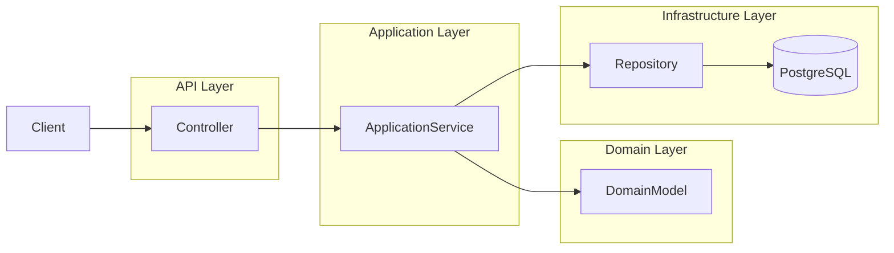

# FinLedger

FinLedger is a backend ledger system implementing double-entry accounting using domain-driven design (DDD) principles. The project demonstrates a production-style
Java backend with layered architecture, strong domain invariants, and test-driven development.

---

## Tech Stack
- Java 21
- Maven
- PostgreSQL
- JPA / Hibernate
- JUnit 5
- Mockito
- AssertJ

---

## Purpose
The backend manages financial transactions while enforcing strict accounting invariants. It demonstrates:
- Domain-driven design (DDD)
- Aggregate modeling
- Repository abstraction
- Service-layer orchestration
- Test-driven development

Core domain concepts include:

- **Account** - financial accounts with currency and type
- **JournalEntry** - represents a transaction
- **JournalLine** - debit/credit lines belonging to a transaction

All transactions must satisfy double-entry accounting rules:
- At least two lines per transaction
- Total debits must equal total credits

---

## Architecture

The backend follows a layered architecture:

api/            Controllers and request/response DTOs

application/    Application services coordinating domain logic

domain/         Core business logic and aggregates

infrastructure/ Persistence adapters (JPA repositories)

---

## System Architecture

---

## Project Structure

src/main/java/com/dustin/finledger

api/            REST controllers and DTOs
application/    Application services and commands
domain/         Core domain logic and aggregates
infrastructure/ JPA repositories and persistence adapters

---

## Example API Endpoints

Create Account

POST    /accounts

Get Account

GET     /accounts/{id}

Record Transaction

POST    /transactions

Get Transaction

GET     /transactions/{id}

Reverse Transaction

POST    /transactions/{id}/reverse

Get Account Balance

GET     /accounts/{id}/balance

---

## Domain Rules

The ledger enforces strict accounting invariants:

- Transactions must contain at least two lines
- Debits must equal credits
- All lines in a transaction must share the same currency
- Posted transactions are immutable

---

## Testing

The project includes multiple layers of tests:

- **Domain tests** - verify business rules and invariants
- **Service tests** - test application services with mocked repositories
- **Repository tests** - validate JPA persistence behavior
- **Controller tests** - verify API endpoints and request/response mapping

Run tests with:

mvn test

---

## Running the backend

1. Ensure PostgreSQL is running and configured
2. Navigate to the backend folder:
    `cd backend-spring`
3. Start the application:
    `mvn spring-boot:run`

---

## Future Improvements

- Authentication and authorization
- Transaction pagination
- Audit logging
- Multi-currency account support
- Frontend UI