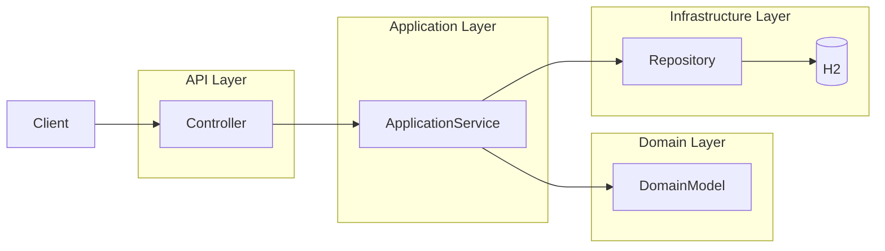

# FinLedger

FinLedger is a backend ledger system implementing double-entry accounting using domain-driven design (DDD) principles. 
The project demonstrates a production-style Java backend with layered architecture, strong domain invariants, and test-driven development.

---

## Tech Stack
- Java 21
- Spring Boot
- Maven
- JPA / Hibernate
- H2 Database
- JUnit 5
- Mockito
- AssertJ

The backend uses an in-memory H2 database for quick local development. Switching to PostgreSQL is straightforward by updating application.properties and adding the driver dependency.

---

## Purpose
The backend manages financial transactions while enforcing strict double-entry accounting invariants. It demonstrates:
- Domain-driven design (DDD)
- Aggregate modeling
- Repository abstraction
- Service-layer orchestration
- Test-driven development

Core domain concepts include:

- **Account** - financial accounts with currency and type
- **JournalEntry** - represents a transaction
- **JournalLine** - debit/credit lines belonging to a transaction

All transactions must satisfy double-entry accounting rules:
- At least two lines per transaction
- Total debits must equal total credits

---

## Architecture

The backend follows a layered architecture:

api/            Controllers and request/response DTOs

api/errors      Global exception handling for API responses

application/    Application services coordinating domain logic

domain/         Core business logic and aggregates

infrastructure/ Persistence adapters (JPA repositories)

---

## Project Structure

src/main/java/com/dustin/finledger

api/            REST controllers and DTOs
application/    Application services and commands
domain/         Core domain logic and aggregates
infrastructure/ JPA repositories and persistence adapters

---

## Example API Endpoints

Create Account

POST    /accounts

Get Account

GET     /accounts/{id}

Record Transaction

POST    /transactions

Get Transaction

GET     /transactions/{id}

Reverse Transaction

POST    /transactions/{id}/reverse

Get Account Balance

GET     /accounts/{id}/balance

---

## API Example Workflow

### Create Account

POST    /accounts

Request:
{
    "name": "Cash",
    "type": "ASSET",
    "currency": "USD"
}

Response (201 Created):
{
    "id": "583d7031-8481-4cb7-9884-16b9fa1c4973",
    "name": "Cash",
    "type": "ASSET",
    "status": "ACTIVE",
    "currency": "USD"
}

### Record Transaction

POST    /transactions

Request:
{
  "description": "Coffee purchase",
  "lines": [
    {
      "accountId": "cash-id",
      "amount": 5.00,
      "currency": "USD",
      "side": "DEBIT",
      "occurredAt": "2026-03-13T10:00:00Z"
    },
    {
      "accountId": "revenue-id",
      "amount": 5.00,
      "currency": "USD",
      "side": "CREDIT",
      "occurredAt": "2026-03-13T10:00:00Z"
    }
  ]
}

Response:
201 Created
Location: /transactions/{id}

### Get Account Balance

GET     /accounts/{id}/balance

Response:
{
    "accountId": "cash-id",
    "amount": 5.00,
    "currency": "USD"
}

### Reverse Transaction

POST /transactions/{id}/reverse

Response:

{
  "description": "Coffee purchase",
  "lines": [
    {
      "accountId": "cash-id",
      "amount": 5.00,
      "currency": "USD",
      "side": "CREDIT"
    },
    {
      "accountId": "revenue-id",
      "amount": 5.00,
      "currency": "USD",
      "side": "DEBIT"
    }
  ],
  "posted": true
}

curl -X POST http://localhost:8080/accounts \
-H "Content-Type: application/json" \
-d '{
  "name": "Cash",
  "type": "ASSET",
  "currency": "USD"
}'

---

## Domain Rules

The ledger enforces strict accounting invariants:

- Transactions must contain at least two lines
- Debits must equal credits
- All lines in a transaction must share the same currency
- Posted transactions are immutable

---

## Testing

The project includes multiple layers of tests:

- **Domain tests** - verify business rules and invariants
- **Service tests** - test application services with mocked repositories
- **Repository tests** - validate JPA persistence behavior
- **Controller tests** - verify API endpoints and request/response mapping

Run tests with:

mvn test

---

## Running the backend

1. Navigate to the backend folder:
    `cd backend-spring`
2. Start the application:
    `mvn spring-boot:run`

---

## Future Improvements

- Authentication and authorization
- Transaction pagination
- Idempotent transacttion endpoints
- Audit logging
- Multi-currency account support
- Frontend UI